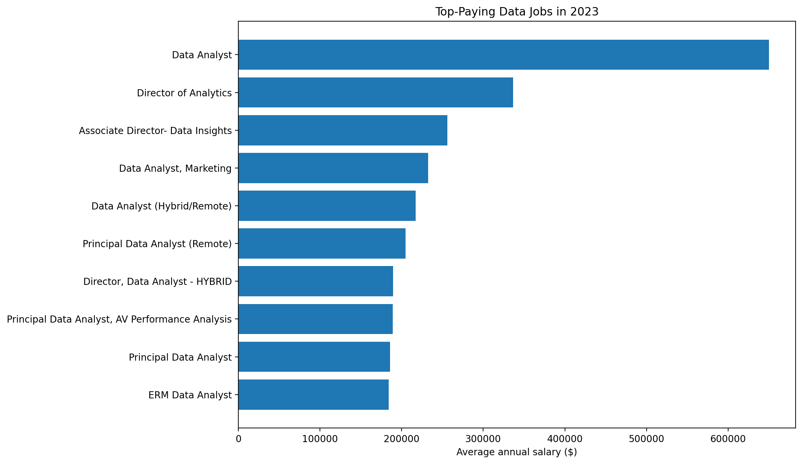
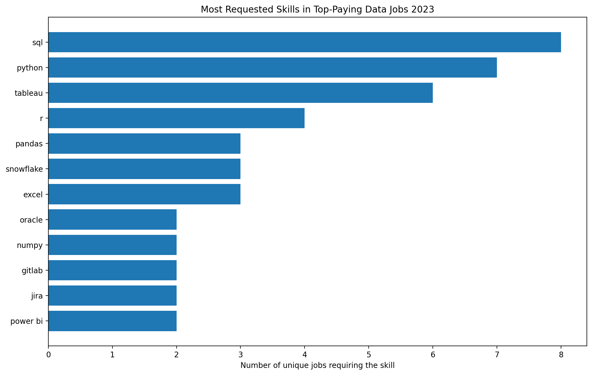
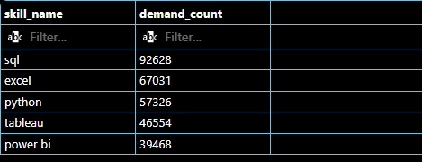
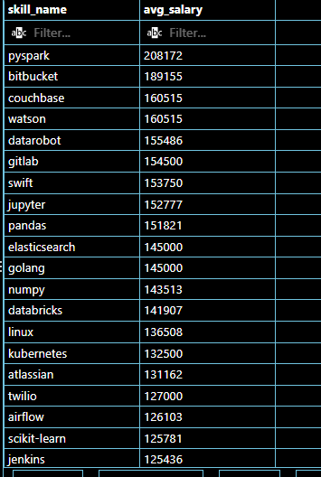
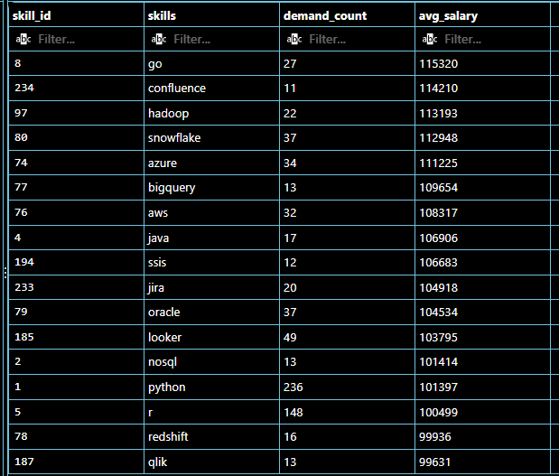

# Introduction

Exploring the data job industry! I focused on the data analyst field, where this project investigates top-paying jobs, high demand skills, and the apex of where high demand meets high paying roles in data analytics.

SQL queries? See them here: [Capstone_Project_SQL](/Capstone_Project_SQL/).

# Background

Driven by a desire to pivot into a more rewarding career which would challenge me to grow and learn new skills, I decided to embark on a journey into the field of data analytics. I scoured the internet in search of a tutor who could help me on this new endeavour. 

Enter **'Luke Barousse'**. He taught me all the necessary skills to be able to run queries, perform aggregations and complete my first SQL project, he also provided me with a data set that would explore the data analytics field, the high paying roles as well as pin point top-paid and in-demand skills.

The data provided was packed with insights on job titles, salaries, locations and essential skills needed to enter the data jobs market.

### The questions I wanted to answer with SQL queries were:

1. What are the top paying data analyst jobs?
2. What skills are required for these top paying jobs?
3. What skills are most in-demand for data analysts?
4. Which skills are associated with higher salaries?
5. What are the most optimal skills to learn?

# Tools I Learned to Use

I mastered the power of several key tools:

- **SQL:** The backbone for data analysts, this allowed me to query the database and bring to light important insights.
- **PostgreSQL:** The chosen database management system, ideal for handling the job posting data.
- **Visual Studio Code:** Fantastic editor for database management and executing SQL queries.
- **Git & Github:** Essential for version control, sharing my SQL scripts, as well as tracking and storing my projects.

# The Analysis

Each query for this project aimed at investigating specific aspects of the data analyst job market.
Here is how I approached each question:

### 1. Top Paying Data Analyst Jobs
To identify the highest paying roles, I filtered data analyst positions by average yearly salary and location, focusing on remote jobs. This query showcases the high paying jobs in the field.

```sql
SELECT
    job_id,
    job_posted_date::DATE AS posted_date,
    job_title,
    name AS company_name,
    job_location,
    job_schedule_type,
    salary_year_avg 
FROM
    job_postings_fact
LEFT JOIN company_dim ON job_postings_fact.company_id = company_dim.company_id
WHERE
    job_title_short = 'Data Analyst' AND 
    job_location = 'Anywhere' AND 
    salary_year_avg IS NOT NULL
ORDER BY
    salary_year_avg DESC
LIMIT 10;
```
Here is a breakdown of the top paying data analyst jobs for 2023:

- **Wide Salary Range:** Top 10 data analyst roles span from $184,000 to $650,000, indicating significant salary potential in the field.
- **Diverse Employers:** Companies like SmartAsset, Meta and AT&T are among those offering high salaries, showing a scope of interest across different industries.
- **Job Title Variety:** There is a great diversity in job titles, ranging from Data Analyst to Director of Analytics, reflecting many roles within data analytics.


*Bar graph visualizing the top 10 paying salaries for Data Analyst roles; ChatGPT generated this graph from my SQL query results.*

### 2. Skills Required For These Top Paying Jobs

To identify the top 10 highest paying data analyst jobs with a detailed look at which skills align with these high salary roles, they help me decide on which core skills and complementary skills to learn first.

```sql
WITH top_paying_jobs AS (
    SELECT
        job_id,
        job_title,
        name AS company_name,
        salary_year_avg
    FROM
        job_postings_fact
    LEFT JOIN company_dim ON job_postings_fact.company_id = company_dim.company_id
    WHERE
        job_title_short = 'Data Analyst' AND 
        job_location = 'Anywhere' AND 
        salary_year_avg IS NOT NULL
    ORDER BY
        salary_year_avg DESC
    LIMIT 10
)

SELECT 
    top_paying_jobs.*,
    skills_dim.skills AS skill_name
FROM 
    top_paying_jobs
INNER JOIN 
    skills_job_dim ON top_paying_jobs.job_id = skills_job_dim.job_id
INNER JOIN
    skills_dim ON skills_job_dim.skill_id = skills_dim.skill_id
ORDER BY
    salary_year_avg DESC;
```
Here is a breakdown of skills required for the top paying data analyst jobs in 2023:

- **SQL:** SQL leads with the highest count of 8 from the Top 10 paying data jobs.
- **Python:** Followed by Python with 7 out of the top 10.
- **Tableau:** Tableau also had a high demand with 6 out of the top 10.
Other skills like **R**, **Snowflake**, **Pandas** and **Excel** show varying degrees of demand, indicating they are also important skills to consider.


*Bar graph visualizing the skills for these top 10 paying Data Analyst roles; ChatGPT generated this graph from my SQL query results.*

### 3. Most In-Demand Skills For Data Analysts

For greater insight from the 2023 data jobs set, I decided to focus on all data job postings and ran a query to narrow down which top 5 skills are highest in demand.

```sql
SELECT 
    skills_dim.skills AS skill_name,
    COUNT(job_postings_fact.job_id) AS demand_count
FROM 
    job_postings_fact
INNER JOIN 
    skills_job_dim ON job_postings_fact.job_id = skills_job_dim.job_id
INNER JOIN
    skills_dim ON skills_job_dim.skill_id = skills_dim.skill_id
WHERE
    job_title_short = 'Data Analyst'
GROUP BY
    skill_name
ORDER BY
    COUNT(job_postings_fact.job_id) DESC
LIMIT 5;
```
Here is a breakdown of the most in-demand skills for data analyst jobs in 2023:

- **SQL:** With the hightest demand count of 92628 from 2023 job postings, it is evident this core skill is essential for querying, managing, and analyzing large datasets.
- **Excel:**  The demand count was 67031 and shows why it is still widely used for data analysis, reporting, calculations, and visualization.
- **Python:** The demand count of 57326 shows how important this skill is for employers and the need for analysts to be able to automate analysis and handle complex datasets.
- **Tableau:** With a count of 46554, Tableau came in forth, as most in-demand skills.
- **Power Bi:** And the fifth most in-demand skill with a count of 39468 was Power BI.



*Screenshot of the temporary results set from the above query; Most in-demand skills for data analysts.*

### 4. Skills Associated With Higher Salaries

It was important for me to run this next query, because I would be able to look at the average salaries associated with each skill for a remote data analyst role, how different skills impact salary levels and to identify the most rewarding skills to acquire.

```sql
SELECT 
    skills_dim.skills AS skill_name,
    ROUND(AVG(job_postings_fact.salary_year_avg), 0) AS avg_salary
FROM 
    job_postings_fact
INNER JOIN 
    skills_job_dim ON job_postings_fact.job_id = skills_job_dim.job_id
INNER JOIN
    skills_dim ON skills_job_dim.skill_id = skills_dim.skill_id
WHERE
    job_title_short = 'Data Analyst' 
    AND salary_year_avg IS NOT NULL
    AND job_work_from_home = TRUE 
GROUP BY
    skill_name
ORDER BY
    avg_salary DESC;
```
Here is a breakdown of the skills associated with high paying data analyst jobs for 2023:

- **Pyspark:** The average salary was **$208,172** and thats probably because PySpark allows Python to process massive amounts of data quickly across multiple computers. Extremely important for mega corporations with millions and billions of records. 
- **Bitbucket:** Supports collaborative coding, version control, and efficient software development workflows, and is most likely why the average salary for this skill is 
**$189,155**.
- **Couchbase:** Enables scalable storage and fast access to flexible, large datasets and therefore reflects an average salary of **$160,515**.
- Other high paying skills would include **Watson**, **Datarobot**, **Gitlab**, **Swift**, **Jupyter**, **Pandas** and more. 



*Screenshot of the temporary results set from the above query; Skills associated with higher salaries for data analysts.*

### 5. Most Optimal Skills To Learn

What are the most optimal skills to learn for a data analyst where high demand meets high-paying skill? 

- Identify skills in high demand and associated with high average salaries for Data Analyst roles.
- Concentrates on remote positions with specified salaries.
- Why? Targets skills that offer job security (high demand) and financial benefits (high salaries), offering strategic insights for career development in data analytics.

```sql
WITH 
    skills_demand AS (
    SELECT
        skills_dim.skill_id, 
        skills_dim.skills AS skill_name,
        COUNT(job_postings_fact.job_id) AS demand_count
    FROM 
        job_postings_fact
    INNER JOIN 
        skills_job_dim ON job_postings_fact.job_id = skills_job_dim.job_id
    INNER JOIN
        skills_dim ON skills_job_dim.skill_id = skills_dim.skill_id
    WHERE
        job_title_short = 'Data Analyst'
        AND salary_year_avg IS NOT NULL
        AND job_work_from_home = TRUE
    GROUP BY
        skills_dim.skill_id
),
salary_average AS (
    SELECT 
        skills_job_dim.skill_id,
        ROUND(AVG(job_postings_fact.salary_year_avg), 0) AS avg_salary
    FROM 
        job_postings_fact
    INNER JOIN 
        skills_job_dim ON job_postings_fact.job_id = skills_job_dim.job_id
    INNER JOIN
        skills_dim ON skills_job_dim.skill_id = skills_dim.skill_id
    WHERE
        job_title_short = 'Data Analyst' 
        AND salary_year_avg IS NOT NULL
        AND job_work_from_home = TRUE
    GROUP BY
        skills_job_dim.skill_id
)

SELECT
    skills_demand.skill_id,
    skills_demand.skill_name,
    demand_count,
    avg_salary
FROM
    skills_demand
    INNER JOIN salary_average ON skills_demand.skill_id = salary_average.skill_id
WHERE
    demand_count > 10
ORDER BY
    avg_salary DESC,
    demand_count DESC;

--Rewritng same query more concisely

SELECT
    skills_dim.skill_id,
    skills_dim.skills,
    COUNT(skills_job_dim.job_id) AS demand_count,
    ROUND(AVG(job_postings_fact.salary_year_avg)) AS avg_salary
FROM
    job_postings_fact
    INNER JOIN skills_job_dim ON job_postings_fact.job_id = skills_job_dim.job_id
    INNER JOIN skills_dim ON skills_job_dim.skill_id = skills_dim.skill_id
WHERE
    job_title_short = 'Data Analyst'
    AND salary_year_avg IS NOT NULL
    AND job_work_from_home = TRUE
GROUP BY
    skills_dim.skill_id
HAVING
    COUNT(skills_job_dim.job_id) > 10
ORDER BY
    avg_salary DESC,
    demand_count
LIMIT 25;
```

The data from this query suggests a "skill ladder" where the skills with the highest demand are more core focused skills, and the more specialized skills are rewarded wih higher salaries.

Here is a breakdown of the most optimal skills to learn for data analyst jobs in 2023:

- **Foundations:** **Python**, **Tableau** and **R** are core skills with high demand and varied applicability.
- **Data Platforms:** **Snowflake**, **Oracle**, **SQL Server** and **BigQuery** are the types of skills needed for database management.
- **Cloud:** Cloud-based data infrastructures would include skills like **Azure**, **AWS** and **Redshift**.
- **Advanced:** **Hadoop**, **Spark**, **GO** and **Java** would be associated with more technical/specialized roles.



*Screenshot of the temporary results set from the above query; Most optimal skills to learn. Note: not all results are visible in screenshot.*

# What I Learned

Throughout this explorative journey, I have increased my knowledge and enhanced my capabilities to use SQL effectively and transform data into a gold mine of insightful information like:

- **Complex Query Crafting:** Mastered advanced SQL techniques, joining multiple tables like a pro and using **WITH** clauses, **CASE** expressions, **UNIONs**, **date functions**, and **operators** to build flexible, efficient, and insightful queries.

- **Data Aggregations:** Got comfortable with using **GROUP BY** and turned aggregate functions like **COUNT()** and **AVG()** into useful tools for summarising data, spotting patterns, and uncovering key insights.

- **Tactical Analysis:** Levelled up my real-world problem-solving skills by turning business questions into practical SQL solutions, using everything from conditional logic and date calculations to set operations and filtering to deliver actionable answers.

# Conclusions

### Insights

1. **Top Paying Data Analyst Jobs:** The highest paying remote data analyst jobs tend to lean more towards **management** or senior roles, with salaries ranging between $184,000 to $650,000.

2. **Skills For Top Paying Jobs:** Data from 2023 job postings reveal that high paying data analyst jobs **require SQL** as a crucial skill.

3. **Most In-Demand Skills:** With the highest demand count **SQL** is listed as the most in-demand skill for job postings in 2023,  highlighting it as *most important* skill for data analyst job applicants.

4. **Skills With Higher Salaries:** Higher than average salaries are offered for speciality skills such as **Pyspark**, **Bitbucket** and **Couchbase**, verifying greater compensation for specialized skills. 

5. **Optimal Skill For Job Market Value:** The optimal skill to have for job market value, based on job postings from 2023 was **SQL** and is confirmed from the data to have the highest demand count with an above-average salary.

### Closing Thoughts

This project improved and enhanced my SQL skills which helped me formulate the necessary insights needed to know what skills are most sought after in the data analyst job market. 

The results from these findings provided me with a clear understanding on which foundational skills to prioritize for growth and development. 

The analytical evidence also shows what employers are searching for from potential job applicants and which specialized skills they are prepared to offer a higher salary for. 

The trends in the market place are constantly changing, which highlights the importance of data analytics in most if not all industries.

Clean, informative and well-prepared data is key to identify market shifts and make sound decisions for positive growth and progress.  


